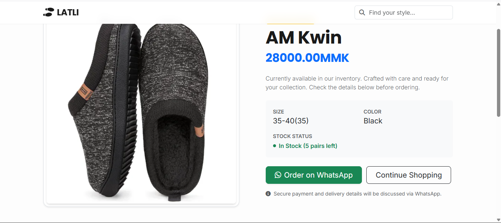

# Shoe Inventory System (Latli Boutique)

A Django-based inventory and sales management system designed for a retail shoe store. This project handles stock tracking, point-of-sale (POS) operations, and customer management with a customized, user-friendly admin interface.

## 🚀 Features

* **Product Management:**
    * Track shoes by category, size, color, gender, and origin.
    * Supports different unit types for stocking (Pairs, Bags, Boxes) with auto-calculation for total pairs.
    * Cloudinary integration for product images.
* **Inventory Control:**
    * Real-time stock calculation (Total Bought - Total Sold).
    * `RestockBatch` system to track when and from whom inventory was added.
* **Point of Sale (POS):**
    * Process sales with automatic total calculation.
    * Support for discounts (percentage-based).
    * Automatically updates stock levels upon sale.
* **Custom Admin Dashboard:**
    * Built with **Django Unfold** for a modern, clean UI.
    * Sidebar navigation for easy access to Products, Sales, Customers, and Staff.
* **WhatsApp Integration:**
    * Generates direct WhatsApp links for products to facilitate customer inquiries.

## 🛠️ Tech Stack

* **Backend:** Python, Django
* **Database:** SQLite (Dev) / PostgreSQL (Prod ready)
* **Media Storage:** Cloudinary
* **Admin Interface:** Django Unfold
* **Static Files:** WhiteNoise
* **Deployment:** Configured for Render/Railway

## ⚙️ Installation & Setup

1.  **Clone the repository:**
    ```bash
    git clone https://github.com/Kyaw-Min-lwin/SHOE-INVENTORY
    cd shoe-inventory
    ```

2.  **Create and activate a virtual environment:**
    ```bash
    python -m venv venv
    # Windows
    venv\Scripts\activate
    # Mac/Linux
    source venv/bin/activate
    ```

3.  **Install dependencies:**
    ```bash
    pip install -r requirements.txt
    ```

4.  **Set up Environment Variables:**
    Create a `.env` file in the root directory and add the following:
    ```ini
    SECRET_KEY=your_secret_key
    CLOUDINARY_CLOUD_NAME=your_cloud_name
    CLOUDINARY_API_KEY=your_api_key
    CLOUDINARY_API_SECRET=your_api_secret
    ```

5.  **Run Migrations:**
    ```bash
    python manage.py migrate
    ```

6.  **Create a Superuser (for the Dashboard):**
    ```bash
    python manage.py createsuperuser
    ```

7.  **Run the Server:**
    ```bash
    python manage.py runserver
    ```

## 📸 Screenshots




## 📄 License

[MIT](https://choosealicense.com/licenses/mit/)